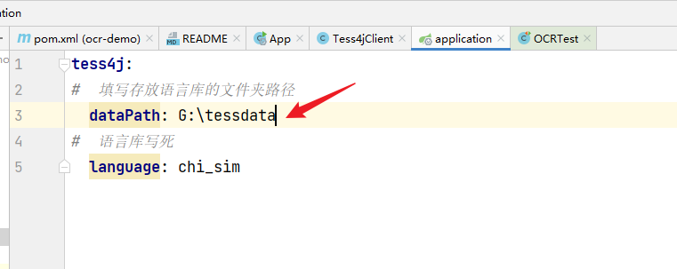
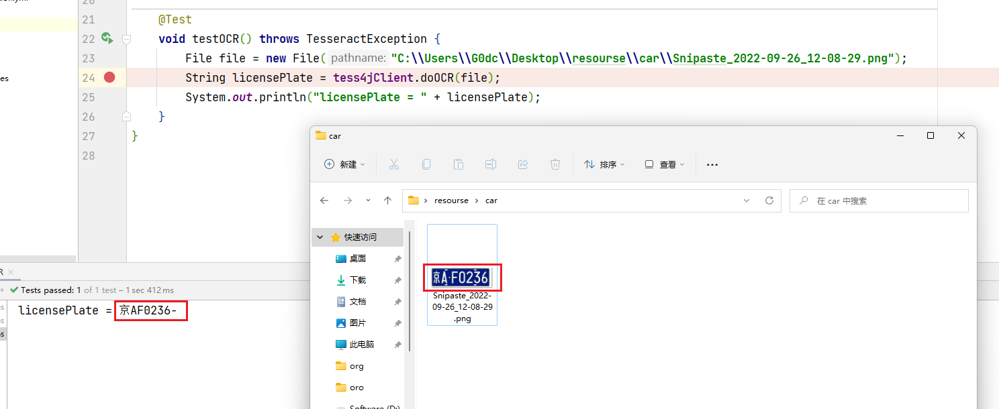

# Tess4j使用说明

## 1.准备环境

1. 将resource文件夹剪切至工作目录下。

2. 修改application.yml中tess4j.dataPath值为语言库的文件夹路径

   

3. tess4j.language无需改变

## 2.准备测试

1. test文件夹下已经写好测试，只需修改文件路径
2. 注意 目前支持 识别的图片的后缀仅为.png

## 3.测试结果

结果基本一致